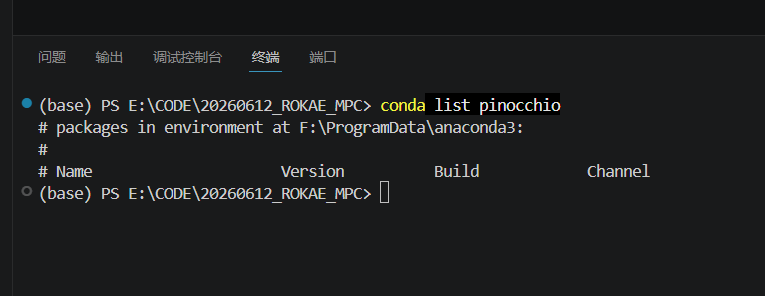

# 基于ABA正动力学的关节空间力矩MPC  
基于珞石SR4六轴协作机器人的MPC模型预测控制  
各个关节采用力矩控制，即控制量为 $\tau$  
在控制过程中，需要用到机器人完整动力学方程，即

$$
M(q)\ddot{q}+C(q,\dot{q})\dot{q}+G(q)=\tau
$$

状态变量：

$$
q,\dot{q}
$$

ABA正动力学作用：  

$$
(q,\dot{q},\tau)\Longrightarrow \ddot q
$$

在力矩控制中， $\ddot q$ 不是独立的状态，而是由ABA动力学方程计算出来的结果  
中间过程：  
首先需要轨迹规划器用来规划轨迹，得到对应的 $q$ 和 $\dot{q}$  ，MPC需要求解最优的 $\tau$ ，为了知道这个 $\tau$ 作用后下一步机器人的状态 $q\_{k+1},\dot{q}_{k+1}$ ,需要用到机械臂的动力学方程 $M(q)\ddot{q}+C(q,\dot{q})\dot{q}+G(q)=\tau$ ，所以在给定上一时刻的力矩 $\tau_k$ 后，必须通过ABA算法先计算 $\ddot{q}_k$ ，然后根据离散积分来推测下一时刻的机器人状态 $q_{k+1},\dot{q}_{k+1}$   
类比倒立摆，也就是在定义状态变量X后，还要对其求导，得到非线性状态空间方程；也就相当于线性状态空间方程中的 $\dot{x}(t)=Ax(t)+Bu(t)$ 公式一个道理  
同时，在控制频率很高时，可以使用上一时刻的控制指令 $u_{k-1}$ ,来输入一阶泰勒展开公式，来进行非线性方程的线性化，即：

$$
\dot{X}\approx f(X_k,u_{k-1})+A_k(X-X_k)+B_k(u-u_{k-1})
$$

然后通过这个函数求解出来   
注意：该代码前期在Windows编程，后期将迁移到Linux中  
## 文件定义
* scr：源代码文件  
    src\dynamics_matrix.cpp:用来生成机器人动力学矩阵，包括惯性矩阵 $M(q)$ ，科里奥利力与离心力矩阵 $C(q,\dot q)$ ,重力矢量 $G(q)$
* test：测试文件  
    test\test_dynamics.cpp:用来测试Pinocchio是否配置正确
* python：python代码文件

************
在利用雅可比矩阵求解矩阵 $A_k、B_k$ 时，使用C++库Pinocchio和CasADi库，其中，利用Pinocchio库来进行矩阵的获取，因为在理想情况下有下面公式：  

$$
\dot X=\begin{bmatrix}
 \dot q\\
\ddot q
\end{bmatrix}=\begin{bmatrix}
\dot q \\
ABA(q,\dot q,\tau)
\end{bmatrix}
$$

但是在求解矩阵的时候，我希望用现成的库函数进行计算，即Pinocchio机器人动力学库，然后再使用CasADi求解出雅可比解，此时公式可以写为：  

$$
\dot X=\begin{bmatrix}
 \dot q\\
\ddot q
\end{bmatrix}=\begin{bmatrix}
\dot q \\
M^{-1}(q)(\tau-C(q,\dot q)\dot q -g(q))
\end{bmatrix}
$$

其中，矩阵 $M^{-1}(q),C(q,\dot q),g(q)$ 可以通过Pinocchio求解得到  
因此，首先来进行这三个动力学矩阵的求解  
## 1 Pinocchio库动力学矩阵求解  
### 1.1 前置库安装
首先在windows里面安装Pinocchio，这里可以使用Conda，可以用下面的指令来检查是否安装了Pinocchio，即：`conda list pinocchio`



如果出现上面图的情况，说明没有安装Pinocchio，可以利用pip下载，具体终端命令为:`conda install pinocchio -c conda-forge `,安装过程如下  
首先需要新建一个环境，使用命令`conda create -n mpc_rokae python=3.10 -y`

<div align="center">
    
    <br>
    图 ：对应环境的文件夹
</div>

一定要在新的环境下载

<div align="center">
    
    <br>
    图 ：对应环境的文件夹
</div>

注意：千万不要在base环境里面直接`conda install pinocchio -c conda-forge `，因为这样会检索base环境里面所有的包，速度非常慢，一直卡在solving里面，一定要新建一个环境，并且千万不能使用pip安装，pip安装的是不对的Pinocchio库

在下载完成之后，可以打开对应环境的文件夹查看是否安装到这个环境上面，同时这个文件夹的地址也会用到CMake文件中

<div align="center">
    
    <br>
    图 ：对应环境的文件夹
</div>

相关的CMake configure如下图所示：

<div align="center">
    
    <br>
    图 ：对应的CMake Configure
</div>

在这一步完成后，可以用代码`test\test_dynamics.cpp`进行验证，该代码为AI生成
### 1.2 动力学解析矩阵生成
为了让最终输出的公式为解析式，最终代码如`src\dynamics_matrix.cpp`所示，在其中需要用到CasADi库（CasADi是一个符号计算和自动代码生成工具），因为在python中这两个库是更加容易使用的，因此该项目的矩阵构建方法是通过python生成相关的库，然后在C++中进行调用计算

首先是在conda环境中安装CasADi库，如下图所示：

<div align="center">
    
    <br>
    图 ：下载CasADi
</div>

之后，需要运行代码`python\matrices_generate.py`生成动力学矩阵的函数，生成之后的结果见：

<div align="center">
    
    <br>
    图 ：生成C代码与对应的头文件
</div>
 
然后将对应的代码复制到src和include文件夹里面。  
在获得相应的矩阵代码后，可以使用两个程序进行验证，分别是：python\pinocchio_com_tau.py，使用该程序可以利用Pinocchio动力学库的RNEA函数计算最后的关节输出力矩 $\tau$ ；src\dynamics_com_tau.cpp，使用该程序可以利用生成的动力学矩阵函数，来验证最后计算的关节输出力矩 $\tau$ ；验证过程如下两图

<div align="center">
    
    <br>
    图 ：Python+Pinocchio利用RNEA函数计算&tau;
</div>
 
<div align="center">
    
    <br>
    图 ：C++利用CasADi生成的矩阵函数来计算&tau;
</div>
 
可以看到计算结果基本上保持一致，证明通过CasADi生成的矩阵函数是正确的
### 1.3 矩阵A和矩阵B的生成
因为生成解析代码的过程还是Python比较方便，因此在这个雅可比矩阵生成的过程，还是使用python来生成  
首先来尝试生成矩阵dotX的函数，即：

$$
\dot X = \begin{bmatrix}
\dot q \\
M^{-1}(q)[\tau-C(q,\dot q)\dot q-G(q)]
\end{bmatrix}
$$

代码可以参见：`python\generate_dotX.py`  
下面直接进入矩阵A和矩阵B的生成，已知矩阵A和B分别为矩阵dotX对状态变量X的偏导和对控制输出u的偏导，即下面公式：  

$$
A=\frac{\partial \dot X}{\partial X} ,B = \frac{\partial \dot X}{\partial u} 
$$

利用雅可比函数：
```python
A_sym = casadi.jacobian(dotX_sym, X_sym)
```
详细代码可以参见：`python\generate_A_B.py`  
之后将产生的代码文件分别复制到include和src文件夹，自此矩阵需要的矩阵A和矩阵B的求解已经全部完成  
## 2 机器人MPC动力学MATLAB验证
既然已经实现了A矩阵和B矩阵的求解，那么就可以使用MATLAB进行前期验证，这里还是根据之前的代码进行验证，详细代码的解析可以参见仓库：https://github.com/yzjjx/LTV-MPC_MATLAB ，在这里，仅仅需要修改Cartpole_MPC.m的离线预编译部分即可  
### 2.1 MATLAB安装CasADi
首先需要在MATLAB中安装CasADi，安装过程如下  
需要在CasADi的GitHub Releases页面找到最新的稳定版本，链接为：https://github.com/casadi/casadi/releases ，如图

 
<div align="center">
    
    <br>
    图 ：下载适用于MATLAB的CasADi
</div>

解压文件夹，然后在MATLAB里面添加路径，如图 所示

<div align="center">
    
    <br>
    图 ：下载适用于MATLAB的CasADi
</div>

最后，运行测试代码进行测试，看输出是否正确即可，如图 

<div align="center">
    
    <br>
    图 ：下载适用于MATLAB的CasADi
</div>

### 2.2 使用CasADi在MATLAB里面加载生成的C代码
首先需要在python的代码加入

```python
# 生成 C 代码
opts = dict(main=False, mex=True, with_header=True)
```

其中，`mex=True`用来在.c文件加入MATLAB的mex编译接口，这样在matlab中就可以使用指令`mex robot_AB.c`编译出来对应的mexw64文件，也就是需要先在MTALAB的命令行输入下面的代码：

<div align="center">
    
    <br>
    图 ：MATLAB编译过程
</div>

将两个c函数都编译之后，就可以直接在MATLAB中调用函数，例如代码

```matlab
dotX_current = robot_dotX(q_current, dq_current, U_K(:,k));
```
### 2.3 加入重力补偿
重力补偿：计算并且输出一个抵消机器人自身重力所需的关节力矩，使得机器人在不施加任何外部控制力的情况下，能够像身处太空一样保持在当前姿态，即不会往下掉，也不会网上漂，在动力学方程中，重力补偿就是矩阵 $G(q)$  
所谓不加重力补偿，也就是机器人的重力补偿是开启的，控制器内部不加重力补偿，就是要在动力学公式中提取出来矩阵 $G(q)$，也就是如果在计算A矩阵和B矩阵的时候，用的动力学公式带 $G(q)$ ，就要在最后输出控制力矩的时候，将动力学公式减去 $G(q)$ 

### 2.4 代码运行效果
不加入重力补偿，详细代码参见`MATLAB\ROKAE_SR4_MPC.m`  
没加入重力补偿，代码效果如图 

<div align="center">
    
    <br>
    图 ：代码运行结果(不加重力补偿)
</div>

加入重力补偿，详细代码参见`MATLAB\ROKAE_SR4_MPC_G.m`  
加入重力补偿，代码效果如图

<div align="center">
    
    <br>
    图 ：代码运行结果(加入重力补偿)
</div>

## 3 Windows下的Pinocchio配置：以ROKAE SR4协作机器人为例
首先要打开Mujoco的官网，下载Mujoco：https://mujoco.org/

<div align="center">
    
    <br>
    图 ：下载Mujoco
</div>

之后，选择自己系统对应的版本，因为前期主要集中在Windows仿真，因此选择Windows平台下载

<div align="center">
    
    <br>
    图 ：选择对应版本
</div>

安装完成后，在bin目录找到simulate软件，然后将对应的XML文件拖入这个simulate软件，就可以实现仿真环境的显示

<div align="center">
    
    <br>
    图 ：仿真环境打开
</div>

<div align="center">
    
    <br>
    图 ：机器人显示
</div>

## 4 基于ABA正动力学的关节空间力矩MPC仿真：Mujoco
### 4.1 Windows下环境配置
因为这里的代码基本上跟倒立摆的MPC思路非常相似，因此代码参考 https://github.com/yzjjx/MPC_cartpole_c- ，因为这个代码之前是在Ubuntu环境下部署的，这里要转换为Windows环境，需要重新配置一下  
首先是矩阵计算Eigen库，在安装Pinocchio库之后，Eigen是自动安装的，如果出现报错，修改对应的.vscode\c_cpp_properties.json文件，例如下图：

<div align="center">
    
    <br>
    图 ：Eigen配置
</div>

下一步需要配置qpOASES库，在win环境下，首先需要获取qpOASES的源码，可以从GitHub上拉取

<div align="center">
    
    <br>
    图 ：git clone
</div>

接下来，需要将源码编译为Windows环境下的动态库或者静态库，这里编译为静态库。编译过程如下面两个图所示：

<div align="center">
    
    <br>
    图 ：CMake
</div>

<div align="center">
    
    <br>
    图 ：build
</div>

然后需要修改自己的CMakeLists，大概加入以下内容即可：
```C
target_include_directories(mpc_node PRIVATE 
    "E:/CPP_pac/qpOASES/include"
    "${CMAKE_CURRENT_SOURCE_DIR}/include"
)

target_link_libraries(mpc_node PRIVATE 
    Eigen3::Eigen
    pinocchio::pinocchio
    "E:/CPP_pac/qpOASES/build/libs/Release/qpOASES.lib"
)
```

pybind11配置,需要`conda install pybind11`，然后检查一下即可，如下图所示

<div align="center">
    
    <br>
    图 ：pybind11配置
</div>

### 4.2  URDF模型修改  
原始的URDF模型有一定的问题，如果需要在VSCODE中可视化URDF模型，可以通过插件URDF Visualizer查看，如下图所示  

<div align="center">
    
    <br>
    图 ：URDF Visualizer拓展
</div>

URDF的建模方式与ABA算法的建模方式非常相似，都需要父节点和子节点的相关知识，URDF就是子节点在父节点后面加坐标和旋转  
首先需要定义每一个连杆的坐标系，如下图所示

<div align="center">
    
    <br>
    图 ：连杆坐标系定义
</div>

然后在URDF文件中，就可以将这个坐标固定到原点的某个位置上，如下面所示：
```xml
  <link name="xMateSR4C_link1">
    <visual>
      <geometry>
        <mesh filename="../stl/xMateSR4C_link1.stl" scale="0.001 0.001 0.001"/>
      </geometry>
      <origin rpy="0 0 0" xyz="0 0 0.328"/>
      <material name="white"/>
    </visual>
```
之后，再将旋转坐标系固定到这个需要运行或者旋转的位置上，如下面代码所示：
```xml
  <joint name="xmate_joint_1" type="revolute">
    <parent link="xMateSR4C_base"/>
    <child link="xMateSR4C_link1"/>
    <limit effort="300" lower="-3.1416" upper="3.1416" velocity="10"/>
    <axis xyz="0 0 1"/>
    <origin xyz="0 0 0" rpy="0 0 0" />
  </joint>
```
重点的两行代码为，第一行表示绕什么轴正转或反转，第二行表示距离上一个坐标系（父节点）的距离
```xml
<axis xyz="0 0 1"/>
<origin xyz="0 0 0" rpy="0 0 0" />
```
例如如果关节2是关节1向Z轴向上平移0.328个距离，则代码如下：
```xml
  <joint name="xmate_joint_2" type="revolute">
    <parent link="xMateSR4C_link1"/>
    <child link="xMateSR4C_link2"/>
    <limit effort="300" lower="-2.4222" upper="2.35619" velocity="10"/>
    <axis xyz="0 1 0"/>
    <origin xyz="0 0 0.328" rpy="0 0 0" />
  </joint>
```
完成urdf文件的修改后，点击文件右上角的preview，就可以预览自己的模型是否正确

<div align="center">
    
    <br>
    图 ：模型预览按钮
</div>

<div align="center">
    
    <br>
    图 ：模型预览
</div>

### 4.3 程序运行
首先需要生成A矩阵、B矩阵和G矩阵，这些都是控制器以及重力补偿所需要的量，运行python程序：`python\generate_A_B.py`和`python\generate_G.py`，如下图所示

<div align="center">
    
    <br>
    图 ：矩阵生成
</div>

注意：20260619更新，因为CasADi默认输出为稀疏矩阵，将左上角所有的0都给抹去，因此在导出矩阵A和矩阵B的时候，需要将稀疏矩阵重新转换为稠密矩阵，即在最后生成代码的时候，需要加入`casadi.densify(A_c)`，如下面代码所示：
```python
# 打包成 CasADi 函数，同时需要将稀疏矩阵稠密化，即加上casadi.densify(A_sym)
AB_func = casadi.Function(
    'compute_AB',
    [cq, cdq, ctau],
    [casadi.densify(A_sym), casadi.densify(B_sym)],
    ['q', 'dq', 'tau'],
    ['A', 'B']
)
```
之后，需要在当前部署的python环境中进行cmake，不然默认进行build就会输出错误版本的动态链接库文件，详细描述见仓库 https://github.com/yzjjx/MPC_cartpole_c-
我这里使用的代码为：` cmake -DPython_EXECUTABLE="F:/ProgramData/anaconda3/envs/mpc_rokae/python.exe" -DPython3_EXECUTABLE="F:/ProgramData/anaconda3/envs/mpc_rokae/python.exe" -DPYTHON_EXECUTABLE="F:/ProgramData/anaconda3/envs/mpc_rokae/python.exe" ..`，其中，-D为define，定义变量，然后使用变量名字=路径的方式强行修改CMake内部的寻址配置，之后，用..来指向上一级目录，告诉CMake去哪里寻找CMakeLists.txt，因此终端目录需要是build文件夹，才能使用这个命令。

最终运行视频如下所示（镇定控制）(未添加重力补偿)：

<div align="center">
    
    <br>
    图 ：六轴机器人MPC镇定控制
</div>

输出曲线如下图所示：

<div align="center">
    
    <br>
    图 ：机器人输出q
</div>

<div align="center">
    
    <br>
    图 ：机器人输出dq
</div>

如视频所示的输出文件保存在文件夹：output_20260619 

## 5 机器人MPC随动控制：Mujoco
将镇定控制改为随动控制，就是将状态收敛到0的代价函数改为将跟踪参考轨迹的误差的代价函数，也就是：  
镇定控制是让状态`current_state=0`  
随动控制需要引入参考状态，在这里引入参考状态`x_ref=q_ref;`此时就相当于让误差x_error趋近于0，`x_error=current_state-x_ref`  
为了能在仿真通过python的input函数在终端中实时改变角度，需要建立两个线程，一个线程是运行mujuco和控制器，一个线程用来读取input函数里面输入的角度，需要`import threading`  
然后加入输入线程：

```python
def input_thread():
    global q_ref

    while True:
        try:
            text = input("输入新的关节期望角度，单位度，用空格分隔：")

            new_ref_deg = np.array(
                [float(x) for x in text.split()],
                dtype=np.float64
            )

            if len(new_ref_deg) != num_q:
                print(f"输入维度错误，应为 {num_q} 个角度")
                continue

            with q_ref_lock:
                q_ref = np.deg2rad(new_ref_deg).astype(np.float64)

            print("目标角度:", new_ref_deg)

        except Exception as e:
            print("输入错误:", e)
```
然后启动目标位置输入线程：
```python
threading.Thread(target=input_thread, daemon=True).start()
```
在主循环，记得使用with加锁，防止重复输入导致冲突  
最终实现的机器人MPC随动控制效果如下图所示：

<div align="center">
    
    <br>
    图 ：机器人MPC随动控制
</div>

控制效果视频如下图：  
加入扰动  

<div align="center">
    
    <br>
    图 ：机器人MPC随动控制:加入扰动
</div>

输入目标位置  

<div align="center">
    
    <br>
    图 ：机器人MPC随动控制:输入目标位置
</div>
